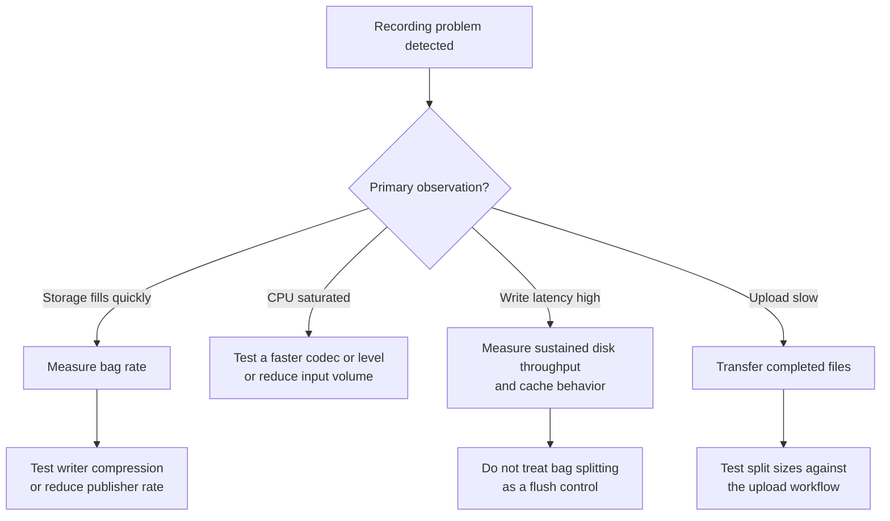

Configure native ROS 2 bag splitting and MCAP chunk compression on NVIDIA Jetson devices. The repository's recording schema is a separate configuration model, not an implemented recording service. Measure storage and CPU behavior on the target device; no setting here guarantees loss-free recording or recovery after interruption.

## Prerequisites

| Requirement             | Details                                                                                |
|-------------------------|----------------------------------------------------------------------------------------|
| NVIDIA Jetson device    | Verify the carrier board, installed storage, and sustained write throughput            |
| ROS 2 Humble or later   | With `rosbag2` and MCAP storage plugin                                                 |
| Recording config schema | `data-pipeline/capture/config/recording_config.yaml`; optional model validation only   |
| Python 3.12+            | For repository Pydantic model validation, not required by the native recording example |

## Quick Start

### Storage Setup

After unboxing, prepare the data drive on the Jetson device.

Storage depends on the Jetson module, carrier board, and purchased kit. Neither a 60 GB Orin Nano drive nor a 500 GB AGX Orin NVMe drive is a universal default. Inspect the installed device and select capacity from measured data rates [^4].

> [!WARNING]
> Partitioning and formatting erase the selected drive. Back up its contents and verify the device path before using the commands below. Skip formatting for an existing data filesystem.

1. Install the M.2 NVMe drive into the Jetson carrier board's M.2 Key M slot (power off first).

1. Identify the drive and create an ext4 partition:

```bash
# Identify the NVMe device
lsblk

# Partition and format (assumes /dev/nvme0n1, adjust if needed)
sudo parted /dev/nvme0n1 --script mklabel gpt mkpart primary ext4 0% 100%
sudo mkfs.ext4 -L recordings /dev/nvme0n1p1
```

1. Mount the drive and configure auto-mount on boot:

```bash
sudo mkdir -p /data/recordings
sudo mount /dev/nvme0n1p1 /data/recordings

# Persist across reboots
echo "/dev/nvme0n1p1 /data/recordings ext4 defaults,noatime 0 2" | sudo tee -a /etc/fstab
```

1. Set ownership and verify write speed:

```bash
sudo chown -R $USER:$USER /data/recordings

# Measure sequential write throughput; compare with the expected recording rate
dd if=/dev/zero of=/data/recordings/test.bin bs=1M count=512 oflag=direct 2>&1 | tail -1
rm /data/recordings/test.bin
```

1. Confirm available space meets recording requirements (see [Storage Capacity Planning](#storage-capacity-planning)):

```bash
df -h /data/recordings
```

### Recording Configuration

Native recording example for a 6-DOF arm, camera, and IMU. The repository YAML below describes intended settings only: `frequency_hz`, per-topic `compression`, triggers, disk thresholds, and gap detection have no recording consumer in this repository.

1. Install ROS 2 bag recording dependencies if not already present:

```bash
sudo apt update && sudo apt install -y \
  ros-humble-rosbag2 \
  ros-humble-rosbag2-storage-mcap
```

1. Create the configuration file on the Jetson device:

```bash
mkdir -p ~/ros2_ws/config
```

1. Optionally save this repository-schema example to `~/ros2_ws/config/recording_config.yaml`. Do not pass it to `ros2 bag record`:

```yaml
topics:
  - name: /camera/color/image_raw
    frequency_hz: 30.0
    compression: zstd

  - name: /joint_states
    frequency_hz: 100.0
    compression: lz4

  - name: /imu/data
    frequency_hz: 200.0
    compression: lz4

trigger:
  type: gpio
  pin: 17
  active_high: true

disk_thresholds:
  warning_percent: 80
  critical_percent: 95

gap_detection:
  threshold_ms: 100.0
  severity: warning

output_dir: /data/recordings
```

1. Save a separate native MCAP writer configuration to `~/ros2_ws/config/mcap_writer.yaml` [^5]:

```yaml
chunkSize: 1048576
compression: "Zstd"
compressionLevel: "Fast"
```

1. Source the ROS 2 environment and verify topics are publishing before recording. The topic list depends on which drivers are running (camera, robot arm, IMU):

```bash
source /opt/ros/humble/setup.bash

# List active topics — expect /camera/color/image_raw, /joint_states, /imu/data
ros2 topic list

# Confirm data is flowing (Ctrl+C to stop)
ros2 topic hz /camera/color/image_raw
```

1. Launch native recording with explicit topics, output path, and bag-file splitting. ROS 2 Humble has no `--config` option for the repository YAML [^7]:

```bash
ros2 bag record \
  --storage mcap \
  --output /data/recordings/session-001 \
  --storage-config-file ~/ros2_ws/config/mcap_writer.yaml \
  --max-bag-size 1073741824 \
  --max-cache-size 104857600 \
  /camera/color/image_raw /joint_states /imu/data
```

Use a new output directory for each recording. Add `/camera/depth/image_raw` explicitly when recording depth; it is not implied by the RGB topic. Native recording does not apply the repository schema's frequency limits or triggers.

1. Verify the recorded bag after stopping the recording (Ctrl+C):

```bash
# List bag metadata and confirm all expected topics appear
ros2 bag info /data/recordings/<bag_directory>
```

## Configuration Reference

### Per-Topic Compression

Each entry in the repository `topics` list describes intended frequency and compression for one topic. Field names match `data-pipeline/capture/config/recording_config.schema.json`; validation does not implement these operations. Native MCAP writer compression applies to chunks containing recorded messages, not separately according to this topic list.

| Field          | Type     | Default  | Valid Values          | Description                                         |
|----------------|----------|----------|-----------------------|-----------------------------------------------------|
| `name`         | `string` | required | Any valid ROS 2 topic | Topic name, must start with `/`                     |
| `frequency_hz` | `float`  | required | `(0, 1000]`           | Intended frequency; no downsampling implementation  |
| `compression`  | `string` | `none`   | `none`, `lz4`, `zstd` | Intended codec; does not configure native recording |

### Compression Algorithm Comparison

The following are illustrative estimates from generic codec benchmarks, not measurements on Jetson or these ROS payloads. Ratios and ARM throughput must be measured before capacity or CPU sizing decisions [^2] [^3].

| Algorithm | Ratio (images) | Ratio (sensor) | Encode Speed (ARM) | CPU Cost | Use Case                                          |
|-----------|----------------|----------------|--------------------|----------|---------------------------------------------------|
| `none`    | 1.0x           | 1.0x           | N/A                | Zero     | Debugging, short captures                         |
| `lz4`     | 1.5 -- 2.0x    | 2.0 -- 3.0x    | ~500 MB/s          | Low      | High-frequency streams (≥100 Hz) [^3]             |
| `zstd`    | 2.5 -- 6.0x    | 3.0 -- 10.0x   | 50 -- 300 MB/s     | Medium   | Image topics, bandwidth-limited uploads [^2] [^6] |

### Bag Chunking Parameters

Bag splitting controls file rotation, not MCAP chunk boundaries or flush durability. Native CLI options below are separate from the repository schema. MCAP `chunkSize` is an approximate uncompressed chunk-size target in the writer YAML; `--max-bag-size` is a bag-file split threshold [^5] [^7].

| Parameter            | Default                             | Recommended           | Description                                                         |
|----------------------|-------------------------------------|-----------------------|---------------------------------------------------------------------|
| `--max-bag-size`     | `0` (no split)                      | `1073741824` (1 GiB)  | Bag-file split threshold in bytes                                   |
| `--max-bag-duration` | `0` (no split)                      | `300` (5 min)         | Split bag file after this duration in seconds                       |
| `--max-cache-size`   | Version-dependent; check local help | `104857600` (100 MiB) | In-memory cache capacity; not a durable flush or recovery guarantee |
| `--storage`          | `sqlite3`                           | `mcap`                | Storage format; MCAP supports chunk-level compression [^5]          |

Smaller bag files can simplify transfer of completed files. They do not establish an upper bound on lost data after a crash; caches, writer buffers, filesystem behavior, and failure timing also matter.

### Disk Thresholds

Repository-schema fields only. A separate monitor must implement warning and stop behavior; native recording does not consume them.

| Field              | Type  | Default | Valid Range | Description                |
|--------------------|-------|---------|-------------|----------------------------|
| `warning_percent`  | `int` | `80`    | `0 -- 100`  | Intended warning threshold |
| `critical_percent` | `int` | `95`    | `0 -- 100`  | Intended stop threshold    |

`warning_percent` must be less than `critical_percent`.

### Gap Detection

Repository-schema fields only; timestamp tracking and gap-event handling are not implemented by the configuration model.

| Field          | Type     | Default   | Valid Range                    | Description                             |
|----------------|----------|-----------|--------------------------------|-----------------------------------------|
| `threshold_ms` | `float`  | `100.0`   | `> 0`                          | Flag gaps longer than this threshold    |
| `severity`     | `string` | `warning` | `warning`, `error`, `critical` | Severity level for gap detection events |

## Storage Capacity Planning

Use measured serialized bag size and elapsed time for production sizing. The retained planning scenario starts with a historical report of roughly 1.3 GB raw per 20-second episode [^1]. It is not a reproducible benchmark for every RGB-D camera, robot, or IMU; generic Silesia benchmarks do not establish ROS 2 payload compression ratios.

### Calculation Methodology

Using decimal units, 1.3 GB ÷ 20 seconds × 3600 = 234 GB/hour. Divide that aggregate rate by a measured compression ratio, then divide available recording capacity by the compressed hourly rate. Reserve space for the OS, logs, and other applications separately.

The previous per-modality figures mixed inconsistent message-size and hourly-rate assumptions. Their 24 GB/hour of joints plus IMU out of 234 GB/hour would be about 10%, not less than 1%. Do not use those message sizes as hardware specifications or infer a sensor percentage without measurement.

### Illustrative Storage Consumption (GB/hour)

| Scenario             | Raw | Assumed 2.5x ratio | Assumed 4x ratio | Assumed 6x ratio |
|----------------------|-----|--------------------|------------------|------------------|
| Historical aggregate | 234 | 94                 | 59               | 39               |

Rounded compressed rates are planning scenarios, not promises for zstd levels 1, 3, or 6. Writer compression levels and payload characteristics must be benchmarked together.

### Recording Duration Until Disk Full

Example available recording capacities, not Jetson hardware specifications. Durations use the rounded rates above; stop with a safety reserve rather than filling the filesystem.

| Available recording capacity | At 94 GB/hour | At 59 GB/hour | At 39 GB/hour |
|------------------------------|---------------|---------------|---------------|
| 50 GB                        | 32 min        | 51 min        | 1 hr 17 min   |
| 200 GB                       | 2 hr 8 min    | 3 hr 23 min   | 5 hr 8 min    |
| 450 GB                       | 4 hr 47 min   | 7 hr 37 min   | 11 hr 32 min  |

Use `df` to determine actual available capacity after reserving operating headroom. The example capacities do not assume a fixed percentage reserved on any particular board.

## Recommended Settings

The following are repository-schema examples for a future consumer, not native recording controls. To change actual recording rates, configure publishers or an implemented downsampling stage. To change MCAP compression, edit the separate writer configuration.

### 6-DOF Arm with RGB-D Camera (Reference Platform)

```yaml
topics:
  - name: /camera/color/image_raw
    frequency_hz: 30.0
    compression: zstd       # Highest storage savings on dominant data stream

  - name: /camera/depth/image_raw
    frequency_hz: 30.0
    compression: zstd

  - name: /joint_states
    frequency_hz: 100.0
    compression: lz4        # Low latency at high frequency

  - name: /imu/data
    frequency_hz: 200.0
    compression: lz4
```

### Bandwidth-Constrained Upload Environment

Describe a lower target camera frequency and compression preference for an upload-constrained workflow:

```yaml
topics:
  - name: /camera/color/image_raw
    frequency_hz: 10.0       # Intended target; no automatic downsampling
    compression: zstd

  - name: /joint_states
    frequency_hz: 100.0
    compression: zstd        # Use zstd even for joints to minimize upload size
```

## Tuning Decisions

| Observation               | Action to test                                                                             |
|---------------------------|--------------------------------------------------------------------------------------------|
| Storage fills too quickly | Measure bag rate; test MCAP writer compression or reduce publisher rate                    |
| CPU is saturated          | Test a faster MCAP codec/level or reduce input volume                                      |
| Write latency is high     | Measure sustained disk throughput and cache behavior; bag splitting is not a flush control |
| Upload is slow            | Transfer completed files; test split sizes against the upload workflow                     |



> [!IMPORTANT]
> Compression, caches, and chunk sizes trade CPU, memory, and throughput. Benchmark each change and validate recorded messages; none guarantees durability after a crash.

## Troubleshooting

### Disk Full During Recording

Native recording can fail when the filesystem fills. The repository's `disk_thresholds` do not implement automatic stopping.

- Check usage with `df -h /data/recordings`
- Configure an external disk monitor and a tested stop procedure
- Test MCAP writer compression against representative payloads
- Transfer and verify completed bags before deleting local copies
- Add storage compatible with the device's carrier board

### Compression CPU Overload

Observed missing messages and high recorder CPU use can indicate overload. The schema's gap settings do not provide a detector.

- Monitor with `tegrastats | grep CPU`
- Test `Lz4` instead of `Zstd` in the MCAP writer configuration
- Reduce publisher rates or use an implemented downsampling stage
- Profile CPU and memory before allocating resources to recording

### Interrupted or Corrupt Bags

`ros2 bag info` reports missing chunks or metadata errors and the bag file is unreadable.

- Verify with `ros2 bag info /data/recordings/<bag_directory>`
- Preserve the original files before attempting recovery
- Inspect recorder logs and use recovery tooling appropriate to the installed rosbag2 and MCAP versions
- Do not assume a larger cache or MCAP format prevents partial writes or guarantees recovery from truncation
- Check SSD health with `smartctl -a /dev/nvme0n1`

### Decompression Failures

Post-processing or LeRobot conversion fails with codec errors. Identify whether the error comes from the MCAP reader, rosbag2 compression plugin, or a separate conversion dependency before changing packages.

- Check the reader's support for the recorded codec and MCAP format
- Verify the bag is complete and compare it with an unmodified source copy
- Record a short sample and validate record, read, and conversion steps with the target toolchain
- Do not infer that matching Python `zstandard` versions repairs a native MCAP decoding failure

## Related Documentation

- [Security Guide](../operations/security-guide.md) for data encryption of recorded bags at rest

## Sources

[^1]: Historical issue #207 technical notes reported roughly 1.3 GB raw per 20-second episode. Retained as an illustrative aggregate, not a verified hardware specification or reproducible benchmark.
[^2]: [Zstandard (zstd) benchmarks](https://github.com/facebook/zstd#benchmarks) — compression ratio 2.896x at level 1 on Silesia corpus, 510 MB/s encode on x86; ARM throughput scaled proportionally.
[^3]: [LZ4 benchmarks](https://github.com/lz4/lz4#benchmarks) — compression ratio 2.101x, 780 MB/s encode on x86 (Core i7-9700K); ARM Cortex-A78AE throughput estimated at ~60-70% of x86.
[^4]: [NVIDIA Jetson Modules](https://developer.nvidia.com/embedded/jetson-modules) — Jetson Orin Nano and AGX Orin series specifications.
[^5]: [MCAP ROS 2 storage plugin](https://mcap.dev/guides/getting-started/ros-2) — `rosbag2_storage_mcap` with chunk-level compression (Lz4, Zstd) and `--storage-config-file` options.
[^6]: [Zstandard RFC 8878](https://datatracker.ietf.org/doc/html/rfc8878) — Zstandard compression data format specification.
[^7]: [ROS 2 Humble record arguments](https://github.com/ros2/rosbag2/blob/humble/ros2bag/ros2bag/verb/record.py): native topic selection, output, splitting, cache, and storage configuration options.
