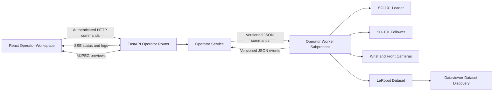

<!-- cspell:words Robotiq Sonix teleoperate teleoperation teleoperator -->

The dataviewer operator view adds local robot operation to the existing dataset analysis application. It starts with SO-101 leader-follower teleoperation and LeRobot recording, then hands completed datasets directly into the existing episode analysis workflow.

## Context

The Physical AI Operator repository demonstrates a complete Collect, Validate, and Play workflow for UR arms using ROS 2, a pure Python session state machine, driver contracts, preflight checks, and a Flask dashboard. The dataviewer already owns dataset discovery, episode playback, analysis, annotation, authentication, diagnostics, and LeRobot v3 data access.

The first integration targets the SO-101 hardware configuration proven by the local `teleoperate.sh` and `record.sh` scripts:

| Device    | Configuration                                                                                          |
|-----------|--------------------------------------------------------------------------------------------------------|
| Leader    | SO-101 leader, `/dev/so101_leader`, ID `my_leader_arm`                                                 |
| Follower  | SO-101 follower, `/dev/so101_follower`, ID `my_follower_arm`                                           |
| Wrist     | OpenCV camera at the stable Sonix `/dev/v4l/by-id/...-video-index0` path, 640x480 at 30 FPS            |
| Front     | Intel RealSense D405, serial `218622278289`, 640x480 at 30 FPS                                         |
| Recording | LeRobot dataset, 30 FPS, 60-second episode limit, 30-second reset window, optional Hugging Face upload |

## Design Decisions

| Decision              | Selected approach                                                                                   | Rationale                                                                                                 |
|-----------------------|-----------------------------------------------------------------------------------------------------|-----------------------------------------------------------------------------------------------------------|
| Application placement | Add a top-level `Analyze` and `Operate` mode switch to the dataviewer shell                         | Operation must work before a dataset exists and needs a dedicated full-height workspace                   |
| Hardware runtime      | Launch a separately locked worker environment through an executable subprocess protocol             | LeRobot dependency constraints conflict with the dataviewer backend and hardware loops must stay isolated |
| Control plane         | Keep session ownership, API authorization, status, and worker supervision in the dataviewer backend | Reuses the existing auth, CSRF, lifecycle, and diagnostics infrastructure                                 |
| Recording integration | Build the worker adapter around LeRobot robot, teleoperator, dataset, and processor APIs            | Browser episode controls cannot drive LeRobot's process-local keyboard event dictionary                   |
| Live updates          | Use server-sent events for state and logs; use dedicated MJPEG endpoints for preview frames         | Commands remain HTTP mutations while low-rate status and camera transport stay independently manageable   |
| Configuration         | Load named, validated operator profiles; ship `so101` as the first profile                          | Keeps device paths, calibration, cameras, and recording defaults out of React and route code              |
| Process concurrency   | Require one backend process and one active worker while operator mode is enabled                    | In-memory ownership is authoritative only in a single FastAPI process                                     |
| Dataset destination   | Write under the configured local dataviewer data root and refresh discovery after finalization      | Makes a completed recording immediately available in Analyze mode                                         |
| Remote deployment     | Disable operator APIs by default and require an explicit local operator configuration               | Cloud dataviewer deployments must never expose robot motion controls accidentally                         |

## Scope

The first release includes:

* A dedicated operator workspace inside the dataviewer
* SO-101 profile discovery and preflight checks
* Leader-follower teleoperation start and stop
* Browser-controlled recording with save, rerecord, finish, and cancel actions
* Live session state, device health, logs, episode progress, and camera previews
* Local dataset finalization and handoff to the Analyze workspace
* Bounded GR00T policy rollout when a server-side runtime and checkpoint are configured
* Behavior tests with a simulated adapter and opt-in hardware smoke tests

The first release excludes:

* UR, ROS 2, RTDE, and Robotiq support
* Digital twin rendering
* Calibration and motor setup from the browser
* Automatic device permission changes or `sudo` execution
* Multi-user session scheduling and remote fleet operation

## Reuse Boundaries

| Source                  | Reuse directly                                                                                          | Adapt or replace                                                                                |
|-------------------------|---------------------------------------------------------------------------------------------------------|-------------------------------------------------------------------------------------------------|
| Dataviewer              | FastAPI auth and CSRF, TanStack Query, API client, diagnostics, UI primitives, dataset discovery        | Extend the shell with a top-level mode and add operator-specific service, routes, hooks, and UI |
| LeRobot                 | SO-101 configs and factories, processor pipelines, camera configs, dataset writer, compatibility checks | Wrap the record and teleoperate loops with explicit commands and event reporting                |
| Physical AI Operator    | Session vocabulary, single-session ownership, preflight model, rate tracking, episode metadata concepts | Do not import ROS nodes, Flask assets, UR drivers, or ROS topic transport                       |
| Existing SO-101 scripts | Stable device paths, IDs, calibration directories, camera settings, recording defaults                  | Replace `sudo chmod`, raw-port guessing, shell activation, and keyboard-only browser controls   |

No runtime dependency on the sibling Physical AI Operator checkout is introduced. Shared concepts move into dataviewer-owned modules, and LeRobot remains the hardware implementation dependency.

## Architecture

### Backend Modules

| Module                                  | Responsibility                                                                  |
|-----------------------------------------|---------------------------------------------------------------------------------|
| `api/routers/operator.py`               | Authenticated status, preflight, session, command, event, and preview endpoints |
| `api/services/operator_service.py`      | Single-session lock, worker ownership, state reduction, event fan-out, cleanup  |
| `api/operator/models.py`                | Pydantic request, response, profile, command, event, and status models          |
| `api/operator/profiles.py`              | Profile loading, path containment, environment overrides, and validation        |
| `api/operator/protocol.py`              | Versioned command, event, acknowledgement, revision, and cleanup models         |
| `api/operator/worker_client.py`         | Simulated subprocess supervision and protocol v1 transport                      |
| `api/operator/lerobot_worker_client.py` | LeRobot subprocess supervision and protocol v2 transport                        |
| `operator-worker/`                      | Separately locked LeRobot hardware environment                                  |
| `api/operator/profile_data/so101.toml`  | SO-101 identities, calibration paths, cameras, timing, and recording defaults   |

### Frontend Modules

| Module                                           | Responsibility                                                                   |
|--------------------------------------------------|----------------------------------------------------------------------------------|
| `components/operator/OperatorWorkspace.tsx`      | Full operator layout and state composition                                       |
| `components/operator/OperatorSessionConfig.tsx`  | Teleoperate, Record, and Policy configuration                                    |
| `components/operator/OperatorCameraPreview.tsx`  | Worker-owned camera previews                                                     |
| `components/operator/OperatorTelemetryPlot.tsx`  | Leader, follower, and commanded joint traces                                     |
| `components/operator/OperatorTrajectoryPlot.tsx` | Shared SO-101 end-effector trajectory view                                       |
| `hooks/use-operator.ts`                          | TanStack queries, mutations, SSE lifecycle, invalidation, and reconnect behavior |
| `api/operator.ts`                                | Typed operator API client                                                        |

## Session Model

The backend owns the authoritative state. The browser renders state and requests transitions but never assumes that a command succeeded before the worker confirms it.

| State       | Meaning                                                        | Allowed actions                        |
|-------------|----------------------------------------------------------------|----------------------------------------|
| `disabled`  | Operator support is not configured                             | None                                   |
| `idle`      | No worker exists                                               | Run preflight                          |
| `starting`  | Worker is connecting hardware                                  | Stop session                           |
| `running`   | Teleoperation or recording loop is active                      | Mode-specific commands, stop session   |
| `stopping`  | Graceful disconnect and dataset finalization are in progress   | None                                   |
| `completed` | Session ended cleanly; a recording may expose a new dataset ID | Analyze dataset, start another session |
| `cancelled` | Session ended by request; committed episodes remain local      | Start another session                  |
| `failed`    | Worker failed or exited unexpectedly                           | Inspect error, rerun preflight         |

Recording adds a nested phase: `recording`, `resetting`, `saving`, or `finalizing`. The service assigns a `service_instance_id`, `session_id`, and monotonically increasing `revision`; workers report facts and acknowledgements but never own authoritative state. The frontend rejects events from another service instance or an older revision.

## API Contract

| Method   | Endpoint                                       | Purpose                                                              |
|----------|------------------------------------------------|----------------------------------------------------------------------|
| `GET`    | `/api/operator/capabilities`                   | Report feature enablement, profiles, modes, and adapter version      |
| `GET`    | `/api/operator/status`                         | Return the current authoritative session snapshot                    |
| `POST`   | `/api/operator/preflights`                     | Probe profile configuration and connected devices                    |
| `GET`    | `/api/operator/preflights/{preflight_id}`      | Read current preflight evidence                                      |
| `DELETE` | `/api/operator/preflights/{preflight_id}`      | Cancel preflight evidence                                            |
| `POST`   | `/api/operator/sessions`                       | Start one `teleoperate` or `record` session                          |
| `POST`   | `/api/operator/sessions/{session_id}/commands` | Send an idempotent `save`, `rerecord`, `finish`, or `cancel` command |
| `DELETE` | `/api/operator/sessions/{session_id}`          | Cancel the named session, then escalate cleanup after a timeout      |
| `GET`    | `/api/operator/events`                         | Stream status, health, progress, diagnostics, and bounded logs       |
| `GET`    | `/api/operator/cameras/{camera}/frame`         | Return the latest worker-owned JPEG preview                          |

All mutations require the existing CSRF token and a client-generated `command_id`. All routes require the existing authentication dependency plus operator authorization. The backend rejects commands that do not match the current state, stale session IDs, and reused command IDs with conflicting payloads.

Operator mode uses the immutable adapter setting `disabled`, `simulated`, or `lerobot`, defaulting to `disabled`. Capability and status endpoints remain mounted when disabled; control endpoints fail closed. Hardware operation with authentication disabled requires loopback binding.

Command outcomes are explicit:

* `save` commits the pending episode and starts the reset phase
* `rerecord` discards the pending episode and restarts that episode
* `pause` stops frame writes while teleoperation remains active
* `resume` restarts frame writes for the pending episode
* `finish` commits the pending episode, finalizes locally, and ends as `completed`
* `cancel` discards the complete dataset created by the session, skips upload, and ends as `cancelled`

## SO-101 Profile

The default profile requires stable udev symlinks. Raw `/dev/ttyACM*` fallback is allowed only through an explicit local profile override because automatic ordering can swap leader and follower roles.

Preflight checks:

* Operator feature flag and profile schema
* LeRobot import and supported adapter version
* Leader and follower device existence, uniqueness, and read/write access
* Leader and follower calibration directories
* Wrist camera path and exclusive open
* RealSense serial discovery and exclusive open
* Dataset root existence, write access, path containment, and free space
* Hugging Face authentication only when upload is enabled
* No active worker or external process holding required devices

The backend never runs `sudo`, changes device permissions, installs udev rules, or guesses which raw serial device is the leader. Failed permission checks return a copyable local remediation command.

## Operator Workspace

The shell header gains a compact segmented control for `Analyze` and `Operate`. Analyze preserves the current dataset selector, diagnostics control, episode list, and annotation workspace. Operate replaces the episode list and viewer with a task-focused control surface.

The Operate layout uses three stable regions:

| Region     | Contents                                                                                         |
|------------|--------------------------------------------------------------------------------------------------|
| Top bar    | Profile, mode, state, elapsed time, device summary, and persistent Stop Session action           |
| Main       | Wrist and front camera previews with fixed aspect ratios, FPS, stale state, and connection state |
| Side panel | Preflight, task and dataset fields, recording controls, episode progress, and bounded logs       |

The physical hardware emergency stop remains the only control labeled E-stop. The web action is labeled `Stop Session` because LeRobot shutdown and motor disconnect are not a certified emergency-stop path.

## Dataset Handoff

Recording writes directly below the local dataviewer data root. The worker reports the resolved repository ID because current LeRobot creation appends a timestamp. The service invalidates dataset discovery only after `finalize()` completes and all cameras and serial devices disconnect.

After completion, the operator switches to Analyze mode and selects the new dataset. Dataset discovery refreshes every 30 seconds and on browser focus. Upload to Hugging Face is opt-in per session and runs after local finalization. Upload failure does not hide or delete the valid local dataset.

Recorded tasks are written into every LeRobot frame and become the episode instruction used by annotation and VLM judging. Analyze mode can add **End effector 3D** beside camera playback using recorded Cartesian poses, HDF5 end-effector poses, or recognized SO-101 joint telemetry.

## Safety and Failure Handling

* Start requires a successful preflight for the selected profile and unchanged profile fingerprint
* Only one worker can own hardware at a time
* Start, command, and stop operations are idempotent where practical
* Browser disconnect does not stop an active session; app-shell status ownership survives Analyze and Operate mode changes
* Backend shutdown requests worker stop, waits for cleanup, then terminates after a configured timeout
* Unexpected worker exit marks the session failed and releases the ownership lock
* Missing cleanup acknowledgement sets `cleanup_unconfirmed` and never claims safe hardware release
* Camera preview loss marks that camera stale without blocking the control loop
* Record mode refuses to start when the target dataset path escapes the configured data root
* Secrets, tokens, raw environment values, local device paths, and full command lines are excluded from capability responses, logs, and events
* Operator mode remains disabled in Azure storage mode for the first release
* Operator mode fails closed when configured with multiple backend workers or replicas

## Features

| Phase | Feature                               | Deliverable                                                                                             | Acceptance signal                                                                               |
|-------|---------------------------------------|---------------------------------------------------------------------------------------------------------|-------------------------------------------------------------------------------------------------|
| 1     | Shell and simulated operator contract | Top-level mode switch, service-owned state, subprocess simulator, status and session-addressed commands | Frontend and backend behavior tests pass without hardware; Analyze behavior remains unchanged   |
| 2     | SO-101 profile and preflight          | Validated profile loader, stable-device checks, calibration/camera/storage probes, readiness UI         | Missing, swapped, busy, or non-writable devices produce specific blocking results               |
| 3     | Teleoperation worker                  | Supervised LeRobot worker, start/stop lifecycle, live rates, bounded logs, graceful cleanup             | Leader drives follower; Stop Session disconnects both arms and releases serial ports            |
| 4     | Browser-controlled recording          | Dataset setup, explicit episode command channel, progress, finalization, optional Hub upload            | Save, rerecord, finish, and cancel produce the expected local LeRobot episodes                  |
| 5     | Live camera workspace                 | Worker-owned JPEG sampling, MJPEG endpoints, fixed wrist/front layout, stale and FPS indicators         | Both configured cameras render without a second process opening either camera                   |
| 6     | Dataset handoff and diagnostics       | Discovery invalidation, Analyze Dataset transition, operator diagnostic events, recovery states         | A completed recording opens in the existing episode analyzer without restarting the dataviewer  |
| 7     | Policy playback                       | Server-selected GR00T runtime, bounded rollout worker, task controls, duration cap, and target clamp    | Preflight verifies the runtime; every target is clamped to at most 5 degrees from current state |

## Test Strategy

| Level                | Coverage                                                                                           | Execution                       |
|----------------------|----------------------------------------------------------------------------------------------------|---------------------------------|
| Backend unit         | State transitions, profile validation, command guards, event sequencing, cleanup, log redaction    | `npm run validate:backend`      |
| Backend API          | Auth, CSRF, conflicts, simulated start/command/stop, reconnect snapshot, disabled feature behavior | `npm run validate:backend`      |
| Frontend component   | Mode switch, preflight failures, running session, episode commands, reconnect, completion handoff  | `npm run validate:frontend`     |
| Frontend integration | Analyze regression and simulated Operate workflow                                                  | `npm run validate:frontend`     |
| Hardware smoke       | Stable ports, both cameras, teleoperate, stop, one short record, rerecord, finalization            | Opt-in local marker and profile |
| Full validation      | Backend, operator-worker, and frontend checks                                                      | `npm run validate`              |

Hardware tests never run in default CI. They require an explicit environment marker, the `so101` profile, physical access to the stop controls, and an operator present.

## Implementation Order

1. Add failing backend contract tests for disabled, idle, start, conflict, command, stop, and worker-failure behavior using a simulated adapter.
2. Implement typed models, the adapter protocol, operator service, router, feature flag, and lifespan cleanup.
3. Add failing frontend tests for the top-level mode switch and simulated operator lifecycle.
4. Implement the operator API client, query hooks, shell mode, workspace, and diagnostics events.
5. Add failing profile and preflight tests, then implement the SO-101 profile and readiness checks.
6. Add worker contract tests, then implement teleoperation in the supervised LeRobot worker.
7. Add recording command tests, then implement browser-controlled episode recording and local finalization.
8. Add camera transport tests and responsive screenshots, then implement worker-owned previews.
9. Add dataset handoff tests, complete diagnostics, and run the opt-in SO-101 smoke procedure.

## Success Criteria

* Analyze mode remains behaviorally unchanged
* Operator mode cannot start unless explicitly enabled and preflight passes
* The SO-101 leader, follower, wrist camera, and D405 are represented by one validated profile
* Teleoperation and recording run outside the FastAPI process
* Browser controls map to explicit worker commands rather than synthetic key presses
* One session owns all hardware and always releases it on stop, failure, or backend shutdown
* Completed local recordings appear in Analyze mode without a dataviewer restart
* Default validation runs without connected hardware
