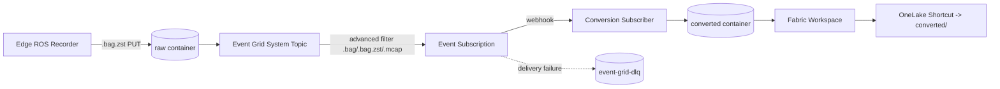

ADLS Gen2 storage with `raw` and `converted` containers, Event Grid system topic + subscription, Microsoft Fabric capacity + workspace, private endpoints, lifecycle policies, RBAC, and diagnostic settings for the data-conversion pipeline.

The module is opt-in. The root composition gates it behind `should_deploy_conversion_pipeline = false` so existing deployments remain unaffected until the conversion compute (issues #32, #34, #72) is wired in.

## 📋 Prerequisites

| Requirement                       | Notes                                                                                                                            |
|-----------------------------------|----------------------------------------------------------------------------------------------------------------------------------|
| Terraform                         | `>= 1.9.8, < 2.0`                                                                                                                |
| `azurerm` provider                | `>= 4.51.0`                                                                                                                      |
| `microsoft/fabric` provider       | `~> 1.0`                                                                                                                         |
| Fabric service principal          | Member of a security group allow-listed under the Fabric tenant admin setting "Service principals can use Fabric APIs"           |
| Fabric SPN scope                  | `Workspace.ReadWrite.All`                                                                                                        |
| Fabric provider auth env vars     | `FABRIC_TENANT_ID`, `FABRIC_CLIENT_ID`, `FABRIC_CLIENT_SECRET`                                                                   |
| Platform module outputs           | `virtual_network`, `subnets`, `private_dns_zones` (`storage_blob`, `storage_dfs`), `log_analytics_workspace`                     |

> [!IMPORTANT]
> The AzureML extension storage account is managed separately by `modules/platform`. This module's storage is dedicated to the conversion pipeline so blast radius and per-environment promotion stay decoupled.

## 🚀 Usage

The module is composed by the root `infrastructure/terraform/main.tf`. To enable in any environment, set `should_deploy_conversion_pipeline = true` in the corresponding tfvars file under `infrastructure/examples/`.

```hcl
should_deploy_conversion_pipeline = true
conversion_pipeline_config = {
  storage_replication_type            = "ZRS"
  should_enable_public_network_access = false
  should_enable_private_endpoint      = true
  fabric_capacity_sku                 = "F8"
  raw_retention_days                  = 30
  converted_archive_days              = 90
  fabric_admin_members                = ["[email protected]"]
}
```

> [!NOTE]
> Use cost-optimized defaults (LRS, F2, public access) only in dev. Staging and prod must use ZRS/GRS, private endpoints, and a Fabric capacity sized for expected workload concurrency.

## 🏗️ Architecture



## ⚙️ Configuration

| Variable                               | Default                            | Purpose                                                                          |
|----------------------------------------|------------------------------------|----------------------------------------------------------------------------------|
| `storage_replication_type`             | `ZRS`                              | LRS for dev, ZRS for staging, GRS for prod                                       |
| `should_enable_shared_key`             | `false`                            | Allow shared-key access. Defaults to Entra-only                                  |
| `should_enable_public_network_access`  | `false`                            | Allow public network access. Set to `true` only for dev                          |
| `allowed_ip_rules`                     | `[]`                               | Public IPs/CIDRs allowed when public access is enabled                           |
| `should_enable_private_endpoint`       | `true`                             | Provision blob + dfs private endpoints                                           |
| `should_enable_diagnostic_settings`    | `true`                             | Route diagnostics to Log Analytics                                               |
| `raw_retention_days`                   | `30`                               | Days to retain raw blobs before deletion (`-1` disables)                         |
| `converted_cool_days`                  | `30`                               | Days before tiering converted blobs to cool                                      |
| `converted_archive_days`               | `90`                               | Days before tiering converted blobs to archive                                   |
| `should_enable_event_grid_dead_letter` | `true`                             | Provision in-account `event-grid-dlq` container                                  |
| `raw_blob_suffix_filters`              | `[".bag", ".bag.zst", ".mcap"]`    | Suffix list for the Event Grid `string_ends_with` advanced filter                |
| `conversion_subscriber_url`            | `null`                             | Webhook URL for the conversion subscriber. Subscription is DLQ-only when `null`  |
| `should_create_fabric_capacity`        | `true`                             | Provision a new Fabric capacity                                                  |
| `should_create_fabric_workspace`       | `true`                             | Provision a Fabric workspace. Requires `fabric_capacity_uuid` to be non-null     |
| `fabric_capacity_uuid`                 | `null`                             | Fabric capacity GUID supplied after capacity creation. See Two-pass deployment   |
| `fabric_capacity_sku`                  | `F2`                               | Fabric capacity SKU (`F2` through `F2048`)                                       |
| `fabric_admin_members`                 | `[]`                               | Entra UPNs/object IDs granted Fabric capacity administration                     |
| `fabric_workspace_sp_object_id`        | `null`                             | Object ID of the Fabric workspace SP. Grants RBAC on raw (read) + converted (rw) |

## 📤 Outputs

| Output                    | Shape                                                                  |
|---------------------------|------------------------------------------------------------------------|
| `storage_account`         | `{ id, name, primary_blob_endpoint, primary_dfs_endpoint }`            |
| `raw_container`           | `{ id, name }`                                                         |
| `converted_container`     | `{ id, name }`                                                         |
| `event_grid_topic`        | `{ id, name, identity_principal_id }`                                  |
| `event_grid_subscription` | `{ id, name }`                                                         |
| `fabric_workspace`        | `{ id, display_name }`                                                 |
| `fabric_capacity`         | `{ id, name, sku }` or `null` when reusing an existing capacity        |

## 🔍 Validation

| Check               | Command                                                                                                |
|---------------------|--------------------------------------------------------------------------------------------------------|
| Format              | `terraform fmt -check -recursive infrastructure/terraform/modules/conversion-pipeline`                 |
| Lint                | `npm run lint:tf`                                                                                      |
| Validate            | `npm run lint:tf:validate`                                                                             |
| Module unit tests   | `cd infrastructure/terraform/modules/conversion-pipeline && terraform init -backend=false && terraform test` |
| Security scan       | `checkov -d infrastructure/terraform/modules/conversion-pipeline --framework terraform`                |

## 🔧 Optional Components

| Component        | Toggle                                 | Notes                                                       |
|------------------|----------------------------------------|-------------------------------------------------------------|
| Private endpoints| `should_enable_private_endpoint`       | Required for staging/prod. Skip in dev for direct access    |
| Dead-letter queue| `should_enable_event_grid_dead_letter` | Backed by an in-account `event-grid-dlq` container          |
| Fabric capacity  | `should_create_fabric_capacity`        | Disable to reuse an existing capacity                       |
| Fabric workspace | `should_create_fabric_workspace`       | Requires `fabric_capacity_uuid`. See Two-pass deployment    |
| Diagnostics      | `should_enable_diagnostic_settings`    | Routes blob and account metrics to Log Analytics            |

## 🔄 Two-pass deployment

The `fabric_workspace.capacity_id` argument expects the Fabric capacity GUID, not the ARM resource ID. The `azurerm_fabric_capacity` resource does not surface the GUID, so workspace creation is split across two applies:

1. First apply: leave `should_create_fabric_workspace = false` (or `fabric_capacity_uuid = null`). The capacity is created.
2. Look up the capacity GUID via the Fabric admin portal or the Fabric REST API (`GET https://api.fabric.microsoft.com/v1/capacities`).
3. Second apply: set `fabric_capacity_uuid` to the discovered GUID and `should_create_fabric_workspace = true`. The workspace is created bound to the capacity.

> [!NOTE]
> Tracking issue: a follow-up will replace the manual lookup with a data source or `azapi_resource_action` once the GUID is exposed.
